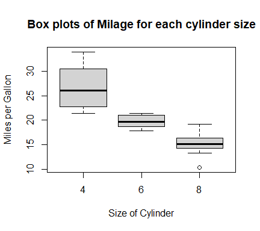

This is an R Markdown document. Markdown is a simple formatting syntax for authoring HTML, PDF, and MS Word Documents. For more details on using R Markdown see http://rmarkdown.rstudio.com.

When you click the **Knit** button a document will be generated that includes both content as well as the output of any embedded R code chunks within a document. You can embed R code chunks like this:

Some basic syntax of preparing the R Markdown document are summarized in this R Markdown document.

## Prior to prepare R Markdown document:
 > 1. install rmarkdown package.
 > 2. install knitr package.
 > 3. Tools, Global Options, Sweave, chane "weave Rnw files using" "knitr".
 > 4. To launch r markdown: file, New file, rmarkdown.
 > 5. Enter the title and author
 
The R Markdown window is now open. Before you begin create your R Markdown document, go to file, Save As, give a R Markdown document name. This file has the file type .Rmd.

Now you are ready to create your document.

During the time you are creating your document, you cna always go to the "knit" icon to create your document in Word, HTML, or PDF.  
NOTE:

To prepare R Markdown document:
File,
Writing a R Markdown document just like writing a scientific report. It usually starts with a title statement, then author, and date.

In creating the document, the following symbols provide the formatting of the document:

# This is a centered title line
## section line
### subsection line
#### sub-subsection line 


* This creates an indented line with a solid dot.
     * five spaces then *: creates 2nd intended line with -
     
* add two spaces to the end of a line starts a new line

> The more space prior to '>', the smaller the font space

*  two spaces at the end of the line take the next sentence to the next line

*  return at the end of a line does not take the following sentence to the next line. This line comes from return of the previous line. But it is not a new line.  This line comes from two spaces after the previous line.

# To write a chunk of r codes in the R markdown document: The syntax is as follows:

```` r
#write your code here. Ends with ```
````

To insert the chunk for the R code, you can go to Chunks icon, Insert Chunk


A few options for controlling the chunk of codes:  

* By default, when you knit the documents, the r coded will be part of the document. If you do not want to see the code, use
     * option:echo = FALSE


* You can embed plots in the document, and specify the figure width and figure height(in inches):


``` r
library(datasets)
head(mtcars)
```

```
##                    mpg cyl disp  hp drat    wt  qsec vs am gear carb
## Mazda RX4         21.0   6  160 110 3.90 2.620 16.46  0  1    4    4
## Mazda RX4 Wag     21.0   6  160 110 3.90 2.875 17.02  0  1    4    4
## Datsun 710        22.8   4  108  93 3.85 2.320 18.61  1  1    4    1
## Hornet 4 Drive    21.4   6  258 110 3.08 3.215 19.44  1  0    3    1
## Hornet Sportabout 18.7   8  360 175 3.15 3.440 17.02  0  0    3    2
## Valiant           18.1   6  225 105 2.76 3.460 20.22  1  0    3    1
```

``` r
mtcars$cyl<-factor(mtcars$cyl)
plot(mtcars$mpg ~ mtcars$cyl, xlab = "Size of Cylinder", ylab = "Miles per Gallon", main = "Box plots of Milage for each cylinder size")
```

<!-- -->


